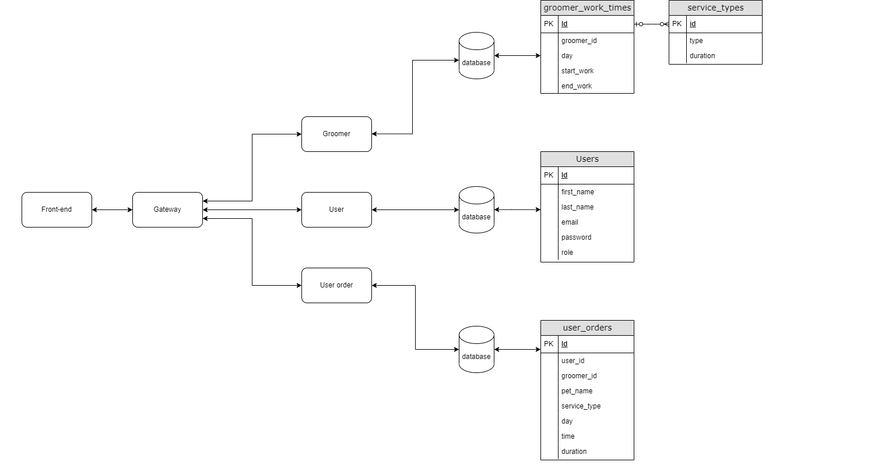
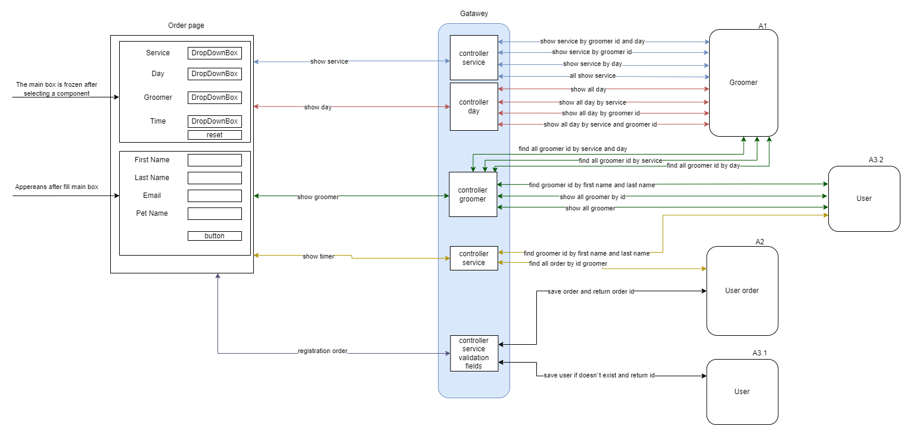

#Introduction

Software represents a registration form to groomer service. 

#Non-functional requirements

* JDK 16+; 
* Maven 3.6+; 
* Database PostgreSQL; 
* Docker-machine; 
* Node.js v16.13.1. 

#Functional requirements

The application provides: 

⦁   choose different options for registration user to service depends on preference; 
⦁   change record if user made mistake and want to choose different options; 
⦁   information about free time for record, if free time doesn't provide that groomer is busy; 
⦁   registration form that contains information about record; 
⦁   registration fields have validation; 
⦁   if registration is successful user will forward to page that show that. 

The application based on four microservice, front-end application and database. That structure is showing on image bellow.

The microservices relate between each other throw REST API. The functional scheme us showing on image bellow

#Use case

The database is filled with test data that is located along the path resource/src/main/resources/initdb 

###Compile project and create container

git clone https://github.com/Hardziyevich/microservice 
./mvnw clean package -DskipTests 
docker-compose up 

Enter the path in the browser: 
http://localhost:3000/ 

#Test case

The application didn't cover integration test.
